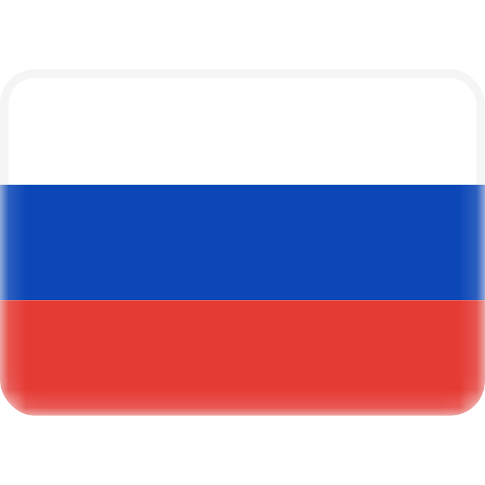
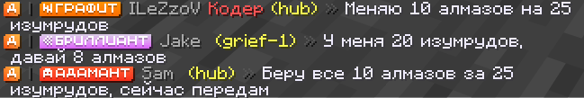
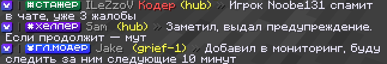
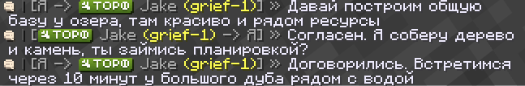
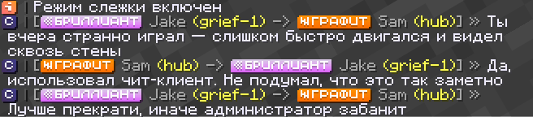
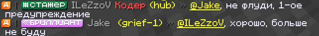
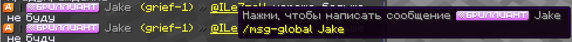

<div align="center">
    
    <h4>Plugin for Velocity Minecraft</h4>
    <h1>Server-to-server chats and private messages </h1>
</div>

### <a href="https://github.com/ilezzov-code/VeloChats/blob/main/README_RU.md"> Выбрать русский README.md</a>

##  <a>Tables of Content</a>

- [About](#about)
- [Features](#features)
- [Config.yml](#config)
- [Commands](#commands)
- [Links](#links)
- [Buy me coffee](#donate)
- [report a bug](https://github.com/ilezzov-code/velochats/issues)


## <a id="about">About</a>

**VeloChats** — this is a unique plugin that allows you to create an infinite number of chats on the Velocity network, as well as to communicate with other players between servers in private messages.

## <a id="features">Features</a>

* **[🔥]** An infinite number of custom chats [more info »](#custom_chats)
* **[🔥]** Full customization of each command and rights [more info »](#custom_commands)
* Private messages and quick replies [more info »](#private_messages)
* Spy mode [more info »](#spy_mode)
* Mention system [more info »](#mention_system)
* White and black list of servers [more info »](#server_filtering)
* Delay for using each command
* Support for MiniMessage colors and old format formats [more info »](#color_support)
* Support for 2 languages (Russian, English) + the ability to create your own translation
* Full customization:
    * Disable / Enable each feature
    * Delay on using each command
    * Detailed rights system


## <a id="custom_chats">Custom chats</a>

You can create an infinite number of chats, and separately configure the rights and message format for each of them

To create a new chat, add a new chat to the `channels` section in `config,yml`. Example below

```yml
channels:
  media-chat:
    enable: true
    command: "media-chat"
    aliases: ["mc", "mediachat"]
    chat-filter:
      mode: WHITELIST
      servers:
        - hub
        - grief-1
        - grief-2
    cooldown: 10
    permissions:
      read: "velochat.chat.media_chat.read"
      write: "velochat.chat.media_chat.write"
      no-cooldown: "velochat.chat.media_chat.cooldown"
      use-color: "velochat.media_chat.use_color"

    format: "<aqua>Медиа Чат <dark_gray>| %player_prefix% %player_nickname% %player_suffix% <yellow>(%player_server%)</yellow> <dark_gray>» <gray>%message%"
```

Here's what custom chats look like in the game:





## <a id="custom_commands">Customization of each command and rights</a>

You can change the name of each plugin command, as well as separately configure the rights to use, delay, and so on. Find the desired command in `config.yml` and configure it as you like.

Example for the /msg command:

```yml
msg:
  enable: true
  command: "msg-global"
  aliases: ["m-global"]
  cooldown: 10
  permissions:
    use: "velochat.msg.use"
    no-cooldown: "velochat.msg.cooldown"
    use-color: "velochat.msg.use_color"
```

## <a id = "private_messages">Private messages</a>

You can enable/disable private messages between servers. To do this, find the `msg` section in `config.yml` and customize it to your needs.

The plugin also supports quick replies using the `/r` command. You can customize this command as well.

Here is how private messages look like in the game:



## <a id = "spy_mode">Spy Mode</a>

If you have enabled private messages, you can also use Spy Mode, or `Spy Command`.

To configure it, find the `spy-command` section in `config.yml`

Here is how Spy Mode looks in the game:



## <a id = "mention_system">Mention system</a>

The plugin supports a mention system. You can customize the mention style, sound, and hover and click actions on the mention.

To configure it, find the `mention` section in `config.yml`

To support sound effects, install the plugin on each Backend server.

Here's how the mention system looks in the game:



## <a id = "server_filtering">White and black list of servers</a>

For private messages and each chat plugin, you can configure server filtering.

```yml
    # Режим фильтрации:
    # Filtering mode:
    # WHITELIST — Разрешает использование только на серверах из списка
    # WHITELIST — Allows use only on servers in the list
    # BLACKLIST — Разрешает использование на всех серверах кроме тех, которые в списке
    # BLACKLIST — Allows use on all servers except those in the list
    # DISABLE — Не использовать режим фильтрации
    # DISABLE — Do not use filtering mode
    mode: WHITELIST
    # Список серверов
    # List of servers
    servers:
      - hub
      - grief-1
      - grief-2
```

This way, you can exclude servers where you don't want any plugin feature to work.

## <a id="config">Config.yml</a>

<details>
    <summary>Посмотреть config.yml</summary>

```yaml
# ██╗░░░██╗███████╗██╗░░░░░░█████╗░░█████╗░██╗░░██╗░█████╗░████████╗
# ██║░░░██║██╔════╝██║░░░░░██╔══██╗██╔══██╗██║░░██║██╔══██╗╚══██╔══╝
# ╚██╗░██╔╝█████╗░░██║░░░░░██║░░██║██║░░╚═╝███████║███████║░░░██║░░░
# ░╚████╔╝░██╔══╝░░██║░░░░░██║░░██║██║░░██╗██╔══██║██╔══██║░░░██║░░░
# ░░╚██╔╝░░███████╗███████╗╚█████╔╝╚█████╔╝██║░░██║██║░░██║░░░██║░░░
# ░░░╚═╝░░░╚══════╝╚══════╝░╚════╝░░╚════╝░╚═╝░░╚═╝╚═╝░░╚═╝░░░╚═╝░░░

# Socials / Ссылки:
# • Contact with me / Связаться: https://t.me/ilezovofficial
# • Telegram Channel / Телеграм канал: https://t.me/ilezzov
# • GitHub: https://github.com/ilezzov-code

# By me coffee / Поддержать разработчика:
# • YooMoney: https://yoomoney.ru/to/4100118180919675
# • Telegram Gift: https://t.me/ilezovofficial
# • TON: UQCInXoHOJAlMpZ-8GIHqv1k0dg2E4pglKAIxOf3ia5xHmKV
# • BTC: 1KCM1QN9TNYRevvQD63UF81oBRSK67vCon
# • Card: 2200 7007 3348 7101 (T-Bank)

# Check for updates / Проверять наличие обновлений
check-updates: true

# Языковой файл. Поддерживаемые (ru-RU, en-US), вы можете загрузить свой перевод, создав файл в папке messages/custom.yml
# Language file. Supported (ru-RU, en-US), you can upload your own translation by creating a file in messages/custom.yml
lang: "ru-RU"

# Настройка упоминая игроков (@nickname)
# Player mention settings (@nickname)
mention:
  # Включить упоминания
  # Enable mentions
  enable: true
  # Формат упоминания
  # Mention format
  format: "<yellow><u>@%nickname%</u></yellow>"
  # Право на использование упоминаний
  # Permission to use mentions
  permission: "velochat.mention"
  # Звук при упоминании
  # Mention sound
  # Для корректной работы установите VeloChat на все сервера, где хотите поддерживать воспроизведение звука
  # For correct operation, install VeloChat on all servers where you want to support sound playback
  sound:
    # Включить звук
    # Enable sound
    enable: true
    # Имя звука
    # Sound name
    value: "MINECRAFT_EXPIRIENCE_PICK_UP"
    # Громкость
    # Volume
    volume: 1.0
    pitch: 1.2
  # Действие при наведении и нажатии
  # Hover and click actions
  interaction:
    # Всплывающее сообщения
    # Hover message
    hover:
      # Включить текст при наведении
      # Enable hover text
      enable: true
      # Типы: SHOW_TEXT (показать текст)
      # Types: SHOW_TEXT
      action: SHOW_TEXT
      # Текст
      # Text
      value:
        - "&7Нажми, чтобы написать сообщение %player_prefix% %player_nickname% %player_suffix%"
        - "&e/%msg_command% %player_nickname%"

    # Действие при нажатии
    # Click action
    click:
      # Включить действие при нажатии
      # Enable click action
      enable: true
      # Типы: OPEN_URL, RUN_COMMAND, SUGGEST_COMMAND, COPY_TO_CLIPBOARD
      # Types: OPEN_URL, RUN_COMMAND, SUGGEST_COMMAND, COPY_TO_CLIPBOARD
      action: SUGGEST_COMMAND
      # Значение
      # Value
      value: "/%msg_command% %player_nickname% "


# Настройка личных сообщений
# Private message settings
msg:
  # Включить личные сообщения
  # Enable private messages
  enable: true
  # Основная команда
  # Main command
  command: "msg-global"
  # Синонимы команды
  # Command aliases
  aliases: ["m-global"]
  # Задержка на использование в секундах
  # Cooldown in seconds
  cooldown: 10
  # Сервера, на которых должна быть доступна команда.
  # Servers where the command should be available.
  # Если игрок находится на запрещенном сервере, он не сможет ни отправлять, ни получать сообщения
  # If a player is on a restricted server, they will not be able to send or receive messages
  chat-filter:
    # Режим фильтрации:
    # Filtering mode:
    # WHITELIST — Разрешает использование только на серверах из списка
    # WHITELIST — Allows use only on servers in the list
    # BLACKLIST — Разрешает использование на всех серверах кроме тех, которые в списке
    # BLACKLIST — Allows use on all servers except those in the list
    # DISABLE — Не использовать режим фильтрации
    # DISABLE — Do not use filtering mode
    mode: WHITELIST
    # Список серверов
    # List of servers
    servers:
      - hub
      - grief-1
      - grief-2

  # Настройки команды дя быстрых ответов
  # Reply command settings
  reply-command:
    # Включить команду
    # Enable command
    enable: true
    # Основная команда
    # Main command
    command: "reply-global"
    # Синонимы команды
    # Command aliases
    aliases: [r-g]
    # Сколько по времени хранить игрока для быстрого ответа (в секундах)
    # How long to store the player for a quick reply (in seconds)
    timeout: 180

  # Настройки команды для режима отслеживания
  # Spy mode command settings
  spy-command:
    # Включить команду
    # Enable command
    enable: true
    # Основная команда
    # Main command
    command: "spy-global"
    # Синонимы команды
    # Command aliases
    aliases: ["s-g"]

  # Права
  # Permissions
  permissions:
    # Разрешить использовать
    # Permission to use
    use: "velochat.msg.use"
    # Разрешить отправку быстрых ответов
    # Permission to reply
    reply: "velochat.msg.reply"
    # Разрешить отслеживать чужие переписки
    # Permission to spy
    spy: "velochat.msg.spy"
    # Разрешить писать без задержки
    # Permission for no cooldown
    no-cooldown: "velochat.msg.cooldown"
    # Разрешить использовать цвета
    # Permission to use colors
    use-color: "velochat.msg.use_color"

  # Плейсхолдеры
  # Placeholders
  # %player_prefix% %player_nickname% %player_suffix% %player_server% — для игрока, отправляющего сообщение
  # %player_prefix% %player_nickname% %player_suffix% %player_server% — for the player sending the message
  # %target_prefix% <target_nickname> <target_suffix> %target_server% — для игрока, принимающего сообщение
  # %target_prefix% <target_nickname> <target_suffix> %target_server% — for the player receiving the message
  # %message% — сообщение
  # %message% — the message
  # Формат сообщений
  # Message format
  format:
    # Для отправителя
    # For the sender
    sender: "<prefix> <gray>[Я -> %target_prefix% <target_nickname> <yellow>(%target_server%)</yellow><gray>] » <white>%message%</white>"
    # Для получателя
    # For the receiver
    receiver: "<prefix> <gray>[%player_prefix% %player_nickname% <yellow>(%player_server%)</yellow> <gray>-> Я] » <white>%message%</white>"
    # /spy режим
    # /spy mode
    spy: "<prefix> <gray>[%player_prefix% %player_nickname% <yellow>(%player_server%)</yellow> <gray>-> %target_prefix% <target_nickname> <yellow>(%target_server%)</yellow><gray>] » <white>%message%</white>"

# Определение каналов чата
# Chat channels definition
channels:
  # Донатерский чат
  # Donator chat
  donate-chat:
    # Включить чат
    # Enable chat
    enable: true
    # Команда для отправки сообщения
    # Command to send message
    command: "donate-chat"
    # Синонимы команды
    # Command aliases
    aliases: ["dc", "donchat"]
    # Сервера, на которых должна быть доступна команда.
    # Servers where the command should be available.
    # Если игрок находится на запрещенном сервере, он не сможет ни отправлять, ни получать сообщения
    # If a player is on a restricted server, they will not be able to send or receive messages
    chat-filter:
      # Режим фильтрации:
      # Filtering mode:
      # WHITELIST — Разрешает использование только на серверах из списка
      # WHITELIST — Allows use only on servers in the list
      # BLACKLIST — Разрешает использование на всех серверах кроме тех, которые в списке
      # BLACKLIST — Allows use on all servers except those in the list
      # DISABLE — Не использовать режим фильтрации
      # DISABLE — Do not use filtering mode
      mode: WHITELIST
      # Список серверов
      # List of servers
      servers:
        - hub
        - grief-1
        - grief-2
    # Задержка на отправку сообщений в мс
    # Cooldown for sending messages in ms
    cooldown: 10
    # Права
    # Permissions
    permissions:
      # Разрешить читать чат
      # Permission to read chat
      read: "velochat.chat.donate_chat.read"
      # Разрешить писать в чат
      # Permission to write to chat
      write: "velochat.chat.donate_chat.write"
      # Разрешить писать без задержки
      # Permission for no cooldown
      no-cooldown: "velochat.chat.donate_chat.cooldown"
      # Разрешить использовать цвета
      # Permission to use colors
      use-color: "velochat.msg.use_color"

    format: "<yellow>Чат-донаторов <dark_gray>| %player_prefix% %player_nickname% %player_suffix% <yellow>(%player_server%)</yellow> <dark_gray>» <gray>%message%"

  # Staff-чат
  # Staff chat
  staff-chat:
    # Включить чат
    # Enable chat
    enable: true
    # Команда для отправки сообщения
    # Command to send message
    command: "staff-chat"
    # Синонимы команды
    # Command aliases
    aliases: [ "sc", "staffchat" ]
    # Сервера, на которых должна быть доступна команда.
    # Servers where the command should be available.
    # Если игрок находится на запрещенном сервере, он не сможет ни отправлять, ни получать сообщения
    # If a player is on a restricted server, they will not be able to send or receive messages
    chat-filter:
      # Режим фильтрации:
      # Filtering mode:
      # WHITELIST — Разрешает использование только на серверах из списка
      # WHITELIST — Allows use only on servers in the list
      # BLACKLIST — Разрешает использование на всех серверах кроме тех, которые в списке
      # BLACKLIST — Allows use on all servers except those in the list
      # DISABLE — Не использовать режим фильтрации
      # DISABLE — Do not use filtering mode
      mode: WHITELIST
      # Список серверов
      # List of servers
      servers:
        - hub
        - grief-1
        - grief-2
    # Задержка на отправку сообщений в мс
    # Cooldown for sending messages in ms
    cooldown: 10
    # Формат сообщений
    # Message format
    format: "<blue>Чат-персонала <dark_gray>| %player_prefix% %player_nickname% %player_suffix% <yellow>(%player_server%)</yellow> <dark_gray>» <gray>%message%"

    # Права
    # Permissions
    permissions:
      # Разрешить читать чат
      # Permission to read chat
      read: "velochat.chat.staff_chat.read"
      # Разрешить писать в чат
      # Permission to write to chat
      write: "velochat.chat.staff_chat.write"
      # Разрешить писать без задержки
      # Permission for no cooldown
      no-cooldown: "velochat.chat.staff_chat.cooldown"
      # Разрешить использовать цвета
      # Permission to use colors
      use-color: "velochat.msg.use_color"

# Internal configuration version. Do not modify!
# Внутренняя версия конфигурации. Не редактируйте!
config-version: ${project.version}
```

</details>

## <a id="commands">Commands (/command → /alias1, /alias2, ... ※ `perms`)</a>

### /velochats reload → /vc reload ※ `velochats.main_comamnd.reload`

* Reload the plugin configuration

## <a id="color_support">Text formatting</a>

The plugin supports all types of text formatting in Minecraft

- **LEGACY** - Color via & / § and HEX via &#rrggbb / §#rrggbb or &x&r&r&g&g&b&b / §x§r§r§g§g§b§b
- **LEGACY_ADVANCED** - Color and HEX via &##rrggbb / §##rrggbb
- **MINI_MESSAGE** - Color via <color> more info - https://docs.advntr.dev/minimessage/index.html

And all formats available on https://www.birdflop.com/resources/rgb/
You can use all formats simultaneously in one message.

## <a id="links">Links</a>

* Contact: https://t.me/ilezovofficial
* Telegram Channel: https://t.me/ilezzov
* Modrinth: https://modrinth.com/plugin/velochats

## <a id="donate">Buy me coffee</a>

* DA: https://www.donationalerts.com/r/ilezov
* YooMoney: https://yoomoney.ru/to/4100118180919675
* Telegram Gift: https://t.me/ilezovofficial
* TON: UQCInXoHOJAlMpZ-8GIHqv1k0dg2E4pglKAIxOf3ia5xHmKV
* BTC: 1KCM1QN9TNYRevvQD63UF81oBRSK67vCon
* Card: 5536914188326494

## Found an issue or have a question? Create a new issue — https://github.com/ilezzov-code/velochats/issues/new

## <a id="license">License</a>

This project is distributed under the `GPL-3.0 License`. more info see [LICENSE](LICENSE).